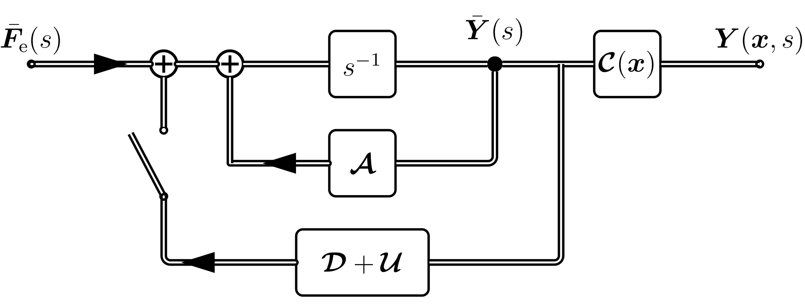

### Block Diagram

<strong>**Figure 1:**</strong> State-space description of the 2D circular membrane in the frequency domain (switch open $\widehat{=}$ open loop system) and the attached feedback loop (switch closed $\widehat{=}$ closed loop system).

### Audio Examples

We present various examples of feedback configurations for the proposed system of the circular membrane for sound synthesis.

## Damping Only
In the following, we apply time-invariant damping only in the feedback via the diagonal matrix $\mathcal{D} = \textrm{diag}( \dots, d_{\mu}, \dots ) $ and $\mathcal{U} = 0$. 

| Damping Type                | Damping Coefficients                 |
|-----------------------------|--------------------------------------|
| No Damping                  | $d_{\mu} = 0$                      |
| Equal Damping               | $d_{\mu}= -2$                      |
| Frequency-dependent Damping | $d\_{\mu} = -0.001 \cdot k_{n,m}^2/R_0^2$ |
| Tension-like Modulation     | $d\_{\mu} = 0.05j \cdot k_{n,m}^2/R_0^2$ |

  

      Sound example with various damping feedback loop.
  

  <ts-track title="Original" data-img="">
      <ts-source src="https://dl.dropboxusercontent.com/s/poxmmtf6sl5kbuw/plateExamples_config_01.m4a?dl=0" type="audio/mpeg"></ts-source>
  </ts-track>
  <ts-track title="Equal Damping" data-img="">
      <ts-source src="https://dl.dropboxusercontent.com/s/dzet0nthvnt8tpa/plateExamples_config_02.m4a?dl=0" type="audio/mpeg"></ts-source>
  </ts-track>
  <ts-track title="Frequency-dependent Damping" data-img="">
      <ts-source src="https://dl.dropboxusercontent.com/s/nmlitqx3evahzd5/plateExamples_config_03.m4a?dl=0" type="audio/mpeg"></ts-source>
  </ts-track>
  <ts-track title="Tension-like Modulation" data-img="">
      <ts-source src="https://dl.dropboxusercontent.com/s/3q6t17k0nvbxnww/plateExamples_config_04.m4a?dl=0" type="audio/mpeg"></ts-source>
  </ts-track>

## Time Variation

In the following, we apply time-variant coupling only in the feedback via the matrix $\gamma\_\textrm{U}[k] \cdot \mathcal{U}$ with $\gamma\_\textrm{U}[k] = \alpha \sin( \beta \, k 2\pi T)$, where $\alpha$ denotes the time-variation amplitude and $\beta$ denotes the time-variation frequency in Hertz ($\mathcal{D} = 0$).

| Feedback Matrix Type | Time variation Amplitude $\alpha$| Time variation Frequency $\beta$   |
|----------------------|----------------------------------|------------------------------------|
| Identity             | 0.00                             | 0                                  |
| Hadamard             | 0.01                             | 5                                  |
| Hadamard             | 0.05                             | 5                                  |
| Hadamard             | 0.02                             | 15                                 |
| Random Orthogonal    | 0.02                             | 15                                 |

  

      Sound example with various strength of time-variation.
  

  <ts-track title="Original" data-img="">
      <ts-source src="https://dl.dropboxusercontent.com/s/poxmmtf6sl5kbuw/plateExamples_config_01.m4a?dl=0" type="audio/mpeg"></ts-source>
  </ts-track>
  <ts-track title="Subtle Variation with Hadamard Matrix" data-img="">
      <ts-source src="https://dl.dropboxusercontent.com/s/ojo0th68s2n908z/plateExamples_config_05.m4a?dl=0" type="audio/mpeg"></ts-source>
  </ts-track>
  <ts-track title="Slow, and large variation with Hadamard Matrix" data-img="">
      <ts-source src="https://dl.dropboxusercontent.com/s/1ejdlzjakitbdmj/plateExamples_config_06.m4a?dl=0" type="audio/mpeg"></ts-source>
  </ts-track>
  <ts-track title="Fast, but small variation with Hadamard Matrix" data-img="">
      <ts-source src="https://dl.dropboxusercontent.com/s/abrb0xfcm0dteqf/plateExamples_config_07.m4a?dl=0" type="audio/mpeg"></ts-source>
  </ts-track>
  <ts-track title="Fast, but small variation with Random Orthogonal Matrix" data-img="">
      <ts-source src="https://dl.dropboxusercontent.com/s/edpwkhijj7l1c89/plateExamples_config_08.m4a?dl=0" type="audio/mpeg"></ts-source>
  </ts-track>

## Experimental Configurations

In the following, we apply time-variant coupling only ($\mathcal{D} = 0$) in the feedback via the matrix with similar parameters as above, but more experimental settings.

| Feedback Matrix Type | Time variation Amplitude $\alpha$| Time variation Frequency $\beta$   |
|----------------------|----------------------------------|------------------------------------|
| Identity             | 0.00                             | 0                                  |
| Hadamard             | 0.05                             | 1.5                                |
| Random Orthogonal    | 0.11                             | 0.1                                |
| Random Householder   | 0.11                             | 1.5                                |
| Householder with Ones| 0.11                             | 1.5                                |

  

      Sound example with more experimental settings.
  

  <ts-track title="Original" data-img="">
      <ts-source src="https://dl.dropboxusercontent.com/s/poxmmtf6sl5kbuw/plateExamples_config_01.m4a?dl=0" type="audio/mpeg"></ts-source>
  </ts-track>
  <ts-track title="Hadamard Matrix with tension-like damping" data-img="">
      <ts-source src="https://dl.dropboxusercontent.com/s/qqr7warneftc3yy/plateExamples_config_09.m4a?dl=0" type="audio/mpeg"></ts-source>
  </ts-track>
  <ts-track title="Random Orthogonal Matrix" data-img="">
      <ts-source src="https://dl.dropboxusercontent.com/s/urnqhv0o0hsszst/plateExamples_config_10.m4a?dl=0" type="audio/mpeg"></ts-source>
  </ts-track>
  <ts-track title="Random Householder Matrix" data-img="">
      <ts-source src="https://dl.dropboxusercontent.com/s/2t5f10xoad6mnys/plateExamples_config_11.m4a?dl=0" type="audio/mpeg"></ts-source>
  </ts-track>
  <ts-track title="Householder One Matrix" data-img="">
      <ts-source src="https://dl.dropboxusercontent.com/s/p2gayy5rmacu6ap/plateExamples_config_12.m4a?dl=0" type="audio/mpeg"></ts-source>
  </ts-track>

### Credits

[Trackswitch.js](https://audiolabs.github.io/trackswitch.js/) was developed by Nils Werner, Stefan Balke, Fabian-Rober Stöter, Meinard Müller and Bernd Edler. 

	