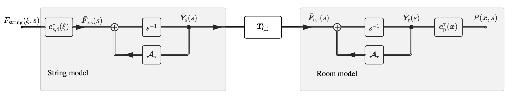

### A String is not a Point Source

In this first animation, we present the spatio-temporal behavior of a string:
<video poster="" title="" controls="controls" style="" width="640" height="">
	<source src="https://dl.dropboxusercontent.com/s/752i2e9ygm4zzop/string_animation.mp4?dl=0" />Your browser does not support this video format.
</video>

In the next step, this string is picked up at a certain position (dashed line) and emitted into a room via an omnidirectional source:
<video poster="" title="" controls="controls" style="" width="640" height="">
	<source src="https://dl.dropboxusercontent.com/s/z658nx5mijt31cd/animatePointStringInRoom.mp4?dl=0" />Your browser does not support this video format.
</video>

Now, instead of the point source modeling, the string object can be placed directly in the room such that the spatial extent of the string is represented directly:
<video poster="" title="" controls="controls" style="" width="640" height="">
	<source src="https://dl.dropboxusercontent.com/s/s16c6zlb624kv1b/animateStringInRoom.mp4?dl=0" />Your browser does not support this video format.
</video>

### Connection Matrix

<strong>**Figure 1:**</strong> State-space description of a 1D string in a 2D room. The connection matrix $\mathbf{T}$ describes the modal connection between the string modes and the room modes. 

The following animation demonstrates the dependency of the connection matrix $\mathbf{T}$ on the spatial position of the string. The string position is rotated in each frame (while the absolute position in the room is similar to the animation above). The top right plot depicts the transfer function of the string (blue) and the resulting transfer function in the room at a pickup position (red):

<video poster="" title="" controls="controls" style="" width="640" height="">
	<source src="https://dl.dropboxusercontent.com/s/xrcp0m0jcc0t2nd/animateStringInRoom_rotation.mp4?dl=0" />Your browser does not support this video format.
</video>

### Audio Examples

We present various sound examples of a string in a room. First, the basic sound examples for string only, point in a room and string in a room with the same configuration as in the animations above.

  

      Sound example with various configuration.
  

  <ts-track title="Only String" data-img="">
      <ts-source src="https://dl.dropboxusercontent.com/s/cvetl93gijsx0zr/stringOnly.wav?dl=0" type="audio/mpeg"></ts-source>
  </ts-track>
  <ts-track title="Point in a Room" data-img="">
      <ts-source src="https://dl.dropboxusercontent.com/s/6og8gq9543smjho/pointInRoom.wav?dl=0" type="audio/mpeg"></ts-source>
  </ts-track>
  <ts-track title="String in a Room" data-img="">
      <ts-source src="https://dl.dropboxusercontent.com/s/dzd4cbq0o1yul9x/stringInRoom.wav?dl=0" type="audio/mpeg"></ts-source>
  </ts-track>

The following audio examples varies the position of the string in the room.

  

      Sound example with string configuration.
  

  
  <ts-track title="Position 1" data-img="soundPlot_string_1.jpg">
      <ts-source src="stringInRoom_1.mp3" type="audio/mpeg"></ts-source>
  </ts-track>
  <ts-track title="Position 2" data-img="soundPlot_string_2.jpg">
      <ts-source src="stringInRoom_2.mp3" type="audio/mpeg"></ts-source>
  </ts-track>
  <ts-track title="Position 3" data-img="soundPlot_string_3.jpg">
      <ts-source src="stringInRoom_3.mp3" type="audio/mpeg"></ts-source>
  </ts-track>
  <ts-track title="Position 4" data-img="soundPlot_string_4.jpg">
      <ts-source src="stringInRoom_4.mp3" type="audio/mpeg"></ts-source>
  </ts-track>
  <ts-track title="Position 5" data-img="soundPlot_string_5.jpg">
      <ts-source src="stringInRoom_5.mp3" type="audio/mpeg"></ts-source>
  </ts-track>
  <ts-track title="Position 6" data-img="soundPlot_string_6.jpg">
      <ts-source src="stringInRoom_6.mp3" type="audio/mpeg"></ts-source>
  </ts-track>
  <ts-track title="Position 7" data-img="soundPlot_string_7.jpg">
      <ts-source src="stringInRoom_7.mp3" type="audio/mpeg"></ts-source>
  </ts-track>
  <ts-track title="Position 8" data-img="soundPlot_string_8.jpg">
      <ts-source src="stringInRoom_8.mp3" type="audio/mpeg"></ts-source>
  </ts-track>
  <ts-track title="Position 9" data-img="soundPlot_string_9.jpg">
      <ts-source src="stringInRoom_9.mp3" type="audio/mpeg"></ts-source>
  </ts-track>
  <ts-track title="Position 10" data-img="soundPlot_string_10.jpg">
      <ts-source src="stringInRoom_10.mp3" type="audio/mpeg"></ts-source>
  </ts-track>

The following audio examples varies the position of the receiver in the room.

  

      Sound example with receiver configuration.
  

  
  <ts-track title="Position 11" data-img="soundPlot_string_11.jpg">
      <ts-source src="stringInRoom_11.mp3" type="audio/mpeg"></ts-source>
  </ts-track>
  <ts-track title="Position 12" data-img="soundPlot_string_12.jpg">
      <ts-source src="stringInRoom_12.mp3" type="audio/mpeg"></ts-source>
  </ts-track>
  <ts-track title="Position 13" data-img="soundPlot_string_13.jpg">
      <ts-source src="stringInRoom_13.mp3" type="audio/mpeg"></ts-source>
  </ts-track>
  <ts-track title="Position 14" data-img="soundPlot_string_14.jpg">
      <ts-source src="stringInRoom_14.mp3" type="audio/mpeg"></ts-source>
  </ts-track>
  <ts-track title="Position 15" data-img="soundPlot_string_15.jpg">
      <ts-source src="stringInRoom_15.mp3" type="audio/mpeg"></ts-source>
  </ts-track>
  <ts-track title="Position 16" data-img="soundPlot_string_16.jpg">
      <ts-source src="stringInRoom_16.mp3" type="audio/mpeg"></ts-source>
  </ts-track>
  <ts-track title="Position 17" data-img="soundPlot_string_17.jpg">
      <ts-source src="stringInRoom_17.mp3" type="audio/mpeg"></ts-source>
  </ts-track>

### Credits

[Trackswitch.js](https://audiolabs.github.io/trackswitch.js/) was developed by Nils Werner, Stefan Balke, Fabian-Rober Stöter, Meinard Müller and Bernd Edler. 

	