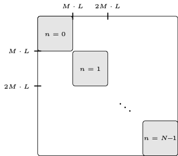

### Contents:
1. Preliminaries
2. Videos of the propagation of the particles in the cylinder for a [*uniform release*](#2-uniform-release-of-particles) supplementary to Fig. 4 (see [[1, Sec. V-D]](#7-references))
3. Videos of the propagation of the particles in the cylinder for a [*point release*](#3-point-release-of-particles) supplementary to Fig. 5 (see [[1, Sec. V-E]](#7-references))
4. Videos of the propagation of the particles in the cylinder for [*analysis of accuracy*](#analysis-of-accuracy) (see [[1, Sec. VI-B]](#7-references))
5. Remarks regarding the [*implementation*](#5-implementation) (see [[1, Sec. VI-A]](#7-references))
6. [*Performance analysis*](#6-analysis-of-runtime-and-complexity)
7. [*References*](#7-references) 

### 1. Preliminaries

We note that the variables in the presented formulas are defined in [[1]](#7-references).

#### 1.1 Summary of the proposed model

The considered advection-diffusion problem with laminar flow is mathematically described by the PDE [[1, Eq. (4)]](#7-references) 
\begin{align*}
\frac{\partial}{\partial t}p(\mathbf{x},t) = D \mbox{div}\left(\mbox{grad}\left( p(\mathbf{x},t)\right)\right) - \mbox{div} \left(p(\mathbf{x},t) v(r)\mathbf{e}_z\right),
\end{align*}
with the radius dependent flow velocity [[1, Eq. (5)]](#7-references) 
\begin{align*}
v(r) = v_0\left(1 - \frac{r^2}{R_0^2}\right).
\end{align*}

The solution of the PDE is derived by a transfer function approach as described in Section IV in [[1]](#7-references). Finally, the concentration $p$ in the volume can be represented in terms of a concentration Green's function in the time domain [[1, Eq. (63)]](#7-references) 
\begin{align*}
&p(\mathbf{x},t) = \int_{V} g(t, \mathbf{x}\vert \mathbf{\xi}) p_\mathrm{init}(\mathbf{\xi})\mathrm{d}{\mathbf{\xi}},
\end{align*}
with Green's function
\begin{align*}
g(t, \mathbf{x}\vert \mathbf{\xi}) = \mathbf{c}_1^{\mathrm{\scriptsize T}}(\mathbf{x}) \mathrm{e}^{\mathbf{\mathcal{A}}_\mathrm{c}(v_0)t}\tilde{\mathbf{c}}^*_4(\mathbf{\xi}).
\end{align*}

For numerical evaluation and analysis of the proposed model a formulation in the discrete-time domain, i.e., in terms of a state-space description is preferred [[1, Eqs. (65), (66)]](#7-references)
\begin{align*}
\bar{\mathbf{y}}^\mathrm{d}[k] &= \mathbf{\mathcal{A}}_{\mathrm{c}}^\mathrm{d}(v_0) \bar{\mathbf{y}}^\mathrm{d}[k - 1] + \bar{\mathbf{f}}^\mathrm{d}_\mathrm{e}[k] + \bar{\mathbf{y}}_\mathrm{init}\delta[k],\\\\[2pt]
p^\mathrm{d}[\mathbf{x},k] &= \mathbf{c}_1^{\mathrm{\scriptsize T}}(\mathbf{x})\bar{\mathbf{y}}^\mathrm{d}[k].
\end{align*}

#### 1.2 Parameters

The proposed model has been derived and is evaluated in terms of normalized physical quantities with respect to a reference length $\rho$ and a reference time $\tau$. 
For numerical evaluation, the parameters in Table 1 are considered.

| Parameter         		| Value                	|Normalized value
| ------------------		| ---------------------	| ---------------------|
| Radius $R_0$          	| $100 \mu\mbox{m}$    	| $1$			|
| Length $Z_0$   		| $1 \mbox{mm}$		|$10$ |
| Flow velocity $v_0$  		| $50 \mu\mbox{m}^{-1}$	|$50$ |
| TX/RX distance $d$   		| $100 \mu\mbox{m}$ 	|$1$ |
| Diffusion coefficient $D$   	| $2.5\cdot 10^{-12}, \dots, 5\cdot 10^{-9} \mbox{m}^2\mbox{s}^{-1}$| $2.5\cdot 10^{-2}, \dots, 50$ |
| Reference length $\rho$   	| $R_0$	||
| Reference time $\tau$   	| $1\cdot 10^{2}\mbox{s}$||

**Table 1:** Physical parameters for numerical evaluation

#### 1.3 Characterization into regimes

The proposed model is classified with respect to existing analytical models. Therefore, the dispersion factor $\alpha$, is introduced [2, Eq. (20)]
$$
\begin{align}
\alpha = \frac{D d}{v_\mathrm{eff} R_0^2}
= \frac{2 D d}{v_0 R_0^2}
,
\end{align}
$$
to distinguish between different regimes. Dispersion factor $\alpha$ is used to classify the considered scenarios into different regimes where the different regimes are realized by changing the diffusion coefficient $D$. For numerical evaluation, the diffusion coefficients $D$ and resulting $\alpha$ values in Table 2 are considered.

|||||||
| ------------------			| ---------------------	| ---------------------| ---------------------| ---------------------| ---------------------| ---------------------| ---------------------|
| $D$ in $\mbox{m}\mbox{s}^{-2}$        | $2.5\cdot 10^{−12}$   | $2.5\cdot 10^{−11}$	| $2.5\cdot 10^{−10}$	| $7.5\cdot 10^{−10}$	| $1.25\cdot 10^{−9}$	| $2.5\cdot 10^{−9}$|$5\cdot 10^{−9}$|
| $\alpha$ 				| $1\cdot 10^{-3}$	|$1\cdot 10^{-2}$ 	| $0.1$ |$0.3$ | $0.5$| $1$| $2$|

**Table 2:** Considered diffusion coefficients $D$ and dispersion factors $\alpha$

#### 1.4 Validation 

For validation, the proposed model is compared to the results from particle based simulations (PBS) and the well-known models for flow-dominant and dispersive regime, see e.g. [[3, Eqs. (11), (16)]](#7-references). The parameters of the PBS are further described in [[1, Sec. V-C]](#7-references).

### 2. Uniform release of particles 

Supplementary to Fig. 3 in [[1, Sec. V-D]](#7-references), we present videos of the particle concentration $p(\mathbf{x},t)$ in the $y$-$z$-plane ($y = r \sin(\frac{\pi}{2})$). Different values of $\alpha$ are considered. 

We note that the value $\alpha$ has been derived based on the normalized TX/RX distance $d = 1$ (see Table 1). Therefore, when the particles pass $z = 2$ in the videos, the regime becomes more dispersive as $\alpha$ increases, i.e., $\alpha \sim d$.

**The videos for a specific $\alpha$ are selected by clicking on the corresponding button**

|$\alpha$         		|Eigenvalues            | Release type 		| 
| ------------------		| --------------------- | ---------------------	| 
|varied| $Q = 6000$, $\mathbf{q} = [0, 30, 200]$ | uniform |

<button onClick="setvideo1('./uniform_alpha_1e-3.mp4');">$\alpha = 1\cdot 10^{-3}$</button>
<button onClick="setvideo1('./uniform_alpha_1e-2.mp4');">$\alpha = 1\cdot 10^{-2}$</button>
<button onClick="setvideo1('./uniform_alpha_1e-1.mp4');">$\alpha = 0.1$</button>
<button onClick="setvideo1('./uniform_alpha_3e-1.mp4');">$\alpha = 0.3$</button>
<button onClick="setvideo1('./uniform_alpha_5e-1.mp4');">$\alpha = 0.5$</button>
<button onClick="setvideo1('./uniform_alpha_1.mp4');">$\alpha = 1$</button>
<button onClick="setvideo1('./uniform_alpha_2.mp4');">$\alpha = 2$</button>

 

<body onload="
initVideo('./uniform_alpha_1e-3.mp4', 'div_video1', 'video_ctrl1');
initVideo('./point_alpha_1e-3_re075.mp4', 'div_video2', 'video_ctrl2')
initVideo('./point_alpha_1e-2_re075.mp4', 'div_video3', 'video_ctrl3')
initVideo('./point_alpha_1e-1_re075.mp4', 'div_video_p01', 'video_ctrl_p01')
initVideo('./point_alpha_5e-1_re075.mp4', 'div_video_p05', 'video_ctrl_p05')
initVideo('./point_alpha_1_re075.mp4', 'div_video_p1', 'video_ctrl_p1')
initVideo('./point_alpha_2_re075.mp4', 'div_video_p2', 'video_ctrl_p2')
initVideo('./accuracy/accuracy_uni_01_q030200.mp4', 'div_video4', 'video_ctrl4')
initVideo('./accuracy/accuracy_point_1e-2_q2030200.mp4', 'div_video5', 'video_ctrl5')
">

<!--alpha 1e-3
$\alpha = 1\cdot 10^{-3}$<video poster="" title="" controls="controls" style="" width="" height="">
	<source src="./uniform_alpha_1e-3.mp4" />Your browser does not support this video format.
</video>-->

### 3. Point release of particles 

Supplementary to Fig. 5 in [[1, Sec. V-E]](#7-references), we present videos of the particle concentration $p(\mathbf{x},t)$ in the $y$-$z$-plane ($y = r \sin(\frac{\pi}{2})$) for a point release of particles. The point releases are centered on the radial axis at three positions $r_e = 0.25, 0.5$, and $0.75$. 

We note that the values $\alpha$ have been derived based on the normalized TX/RX distance $d = 1$ (see Table 1). Therefore, when the particles pass $z = 1$ in the videos, the regime becomes more dispersive and $\alpha$ increases, i.e., $\alpha \sim d$.

**The videos for a specific release position $r_e$ are selected by clicking on the corresponding button**

<!--alpha 1e-3-->

|$\alpha$         		|Eigenvalues            | Release type 		| 
| ------------------		| --------------------- | ---------------------	| 
|$\alpha = 1\cdot 10^{-3}$| $Q = 12.6 \cdot 10^{4}$, $\mathbf{q} = [20, 30, 200]$ | point |

<button onClick="setvideo2('./point_alpha_1e-3_re075.mp4');">$r_e = 0.75$</button>
<button onClick="setvideo2('./point_alpha_1e-3_re05.mp4');">$r_e = 0.5$</button>
<button onClick="setvideo2('./point_alpha_1e-3_re025.mp4');">$r_e = 0.25$</button>

 

<!--alpha 1e-2-->

|$\alpha$         		|Eigenvalues            | Release type 		| 
| ------------------		| --------------------- | ---------------------	| 
|$\alpha = 1\cdot 10^{-2}$| $Q = 12.6 \cdot 10^{4}$, $\mathbf{q} = [20, 30, 200]$ | point |

<button onClick="setvideo3('./point_alpha_1e-2_re075.mp4');">$r_e = 0.75$</button>
<button onClick="setvideo3('./point_alpha_1e-2_re05.mp4');">$r_e = 0.5$</button>
<button onClick="setvideo3('./point_alpha_1e-2_re025.mp4');">$r_e = 0.25$</button>

 

<!--alpha 1e-1-->

|$\alpha$         		|Eigenvalues            | Release type 		| 
| ------------------		| --------------------- | ---------------------	| 
|$\alpha = 0.1$| $Q = 12.6\cdot 10^{4}$, $\mathbf{q} = [20, 30, 200]$ | point |

<button onClick="setvideo_p01('./point_alpha_1e-1_re075.mp4');">$r_e = 0.75$</button>
<button onClick="setvideo_p01('./point_alpha_1e-1_re05.mp4');">$r_e = 0.5$</button>
<button onClick="setvideo_p01('./point_alpha_1e-1_re025.mp4');">$r_e = 0.25$</button>

 

<!--alpha 5e-1-->

|$\alpha$         		|Eigenvalues            | Release type 		| 
| ------------------		| --------------------- | ---------------------	| 
|$\alpha = 0.5$| $Q = 12.6\cdot 10^{4}$, $\mathbf{q} = [20, 30, 200]$ | point |

<button onClick="setvideo_p05('./point_alpha_5e-1_re075.mp4');">$r_e = 0.75$</button>
<button onClick="setvideo_p05('./point_alpha_5e-1_re05.mp4');">$r_e = 0.5$</button>
<button onClick="setvideo_p05('./point_alpha_5e-1_re025.mp4');">$r_e = 0.25$</button>

 

<!--alpha 1-->

|$\alpha$         		|Eigenvalues            | Release type 		| 
| ------------------		| --------------------- | ---------------------	| 
|$\alpha = 1$| $Q = 12.6\cdot 10^{4}$, $\mathbf{q} = [20, 30, 200]$ | point |

<button onClick="setvideo_p1('./point_alpha_1_re075.mp4');">$r_e = 0.75$</button>
<button onClick="setvideo_p1('./point_alpha_1_re05.mp4');">$r_e = 0.5$</button>
<button onClick="setvideo_p1('./point_alpha_1_re025.mp4');">$r_e = 0.25$</button>

 

In addition to Fig. 5 in [[1, Sec. V-E]](#7-references) we present the concentration at the RX over time for $\alpha = 1$ (not shown in the paper):

<!--alpha 2-->

|$\alpha$         		|Eigenvalues            | Release type 		| 
| ------------------		| --------------------- | ---------------------	| 
|$\alpha = 2$| $Q = 12.6\cdot 10^{4}$, $\mathbf{q} = [20, 30, 200]$ | point |

<button onClick="setvideo_p2('./point_alpha_2_re075.mp4');">$r_e = 0.75$</button>
<button onClick="setvideo_p2('./point_alpha_2_re05.mp4');">$r_e = 0.5$</button>
<button onClick="setvideo_p2('./point_alpha_2_re025.mp4');">$r_e = 0.25$</button>

 

In addition to Fig. 5 in [[1, Sec. V-E]](#7-references) we present the concentration at the RX over time for $\alpha = 2$ (not shown in the paper):

### 4. Analysis of accuracy

Supplementary to [[1, Sec. VI]](#7-references), we present videos of the particle concentration $p(\mathbf{x},t)$ in the $y$-$z$-plane ($y = r \sin(\frac{\pi}{2})$).

#### 4.1 Numerical reflections due to absorbing boundary

As described in [[1, Sec. VI-B]](#7-references), the numerical evaluation of the proposed model leads to undesired effects due to the restriction of the cylinder in $z$-direction. 

|$\alpha$         		|Eigenvalues            | Release type 		| 
| ------------------		| --------------------- | ---------------------	| 
|$\alpha = 1\cdot 10^{-3}$ | $Q = 6000$, $\mathbf{q} = [0, 30, 200]$ | uniform |

<video poster="" title="" controls="controls" style="" width="" height="">
	<source src="./uniform_alpha_1e-3_refl.mp4" />Your browser does not support this video format.
</video>

Instead of leaving the cylinder at $z = Z_0$, particles are reflected and re-enter the cylinder at $z = 0$. The re-entering process is accompanied by undesired reflections. 

The occurring effect is well investigate in the modeling of wave-propagation in the free space and it can be avoided by the design of a perfectly matched layer. In future work, we want to overcome this effect by adopting the techniques presented in [[4]](#7-references).

#### 4.2 Undesired oscillations for small values of $\alpha$

As described  in [[1, Sec. VI-B]](#7-references), the numerical evaluation of the proposed model is limited in the flow dominant regime for very small values of $\alpha$. The amplitude, duration and shape of the uniform release of particles is perfectly captured at the RX position (see [[1, Fig. 8c]](#7-references)), while undesired oscillations occur afterwards. The video shows the emergence of these oscillations. 

|$\alpha$         		|Eigenvalues            | Release type 		| 
| ------------------		| --------------------- | ---------------------	| 
|$\alpha = 1\cdot 10^{-5}$ | $Q = 6000$, $\mathbf{q} = [0, 30, 200]$ | uniform |

<video poster="" title="" controls="controls" style="" width="" height="">
	<source src="./uniform_alpha_1e-5.mp4" />Your browser does not support this video format.
</video>

In the video it can be seen, that the laminar shape of the flow profile is not captured perfectly. Furthermore, it is superimposed by undesired oscillations.

These oscillations originate from the well-known Gibb's phenomenon which generally occurs when discontinuous and peaky functions are approximated by a finite series of continuous sine or cosine functions. Therefore, for the problem at hand, the phenomenon occurs for peaky particle releases that do not change their shape during transmission in the flow based regime. For larger values of $\alpha$, the oscillations do not occur because the initially sharp peak is blurred by diffusion. Although, Gibb's phenomenon cannot be avoided completely for scenarios with very small $\alpha$ and a peaky initial release, it can be suppressed by increasing $Q$ (see [[1, Fig. 9c]](#7-references)). 

#### 4.3 Dependence of accuracy on number of eigenvalues $Q$

Supplementary to Figs. 8a and b in [[1, Sec. VI-B]](#7-references) we present videos of the particle concentration $p(\mathbf{x},t)$ in the $y$-$z$-plane ($y = r \sin(\frac{\pi}{2})$) for different values of $Q$. 
The videos emphasize the dependency of the numerical evaluation of the proposed model on the number of eigenvalues $Q$.

The number of eigenvalues is [[1, Eq. (67)]](#7-references)
\begin{align*}
&Q = (2N + 1)\cdot M \cdot L &\mathbf{q} = \left[N, M, L\right].
\end{align*} 

##### 4.3.1 Uniform release of particles

The following videos correspond to the scenario in Fig. 8a, i.e., a uniform release of particles for different values of $Q$.

|$\alpha$         		|Eigenvalues            | Release type 		| 
| ------------------		| --------------------- | ---------------------	| 
|$\alpha = 0.1$ | varied | uniform |

**The videos for a specific number of eigenvalues $Q$, defined by vector $\mathbf{q}$ are selected by clicking on the corresponding button**

<button onClick="setvideo4('./accuracy/accuracy_uni_01_q030200.mp4');">$\mathbf{q} = \left[0,30,200\right]$</button>
<button onClick="setvideo4('./accuracy/accuracy_uni_01_q020150.mp4');">$\mathbf{q} = \left[0,20,150\right]$</button>
<button onClick="setvideo4('./accuracy/accuracy_uni_01_q01050.mp4');">$\mathbf{q} = \left[0,10,50\right]$</button>
<button onClick="setvideo4('./accuracy/accuracy_uni_01_q0250.mp4');">$\mathbf{q} = \left[0,2,50\right]$</button>
<button onClick="setvideo4('./accuracy/accuracy_uni_01_q0210.mp4');">$\mathbf{q} = \left[0,2,10\right]$</button>

 

- The videos show, that the proposed model perfectly captures the influence of diffusion and flow on the propagation of the particles for $Q = 6000$ and $Q = 3000$. 
- For $Q = 500$ it can be seen that for $t = 0$ the initial uniform distribution is interfered by reflections that originate from Gibb's phenomenon, i.e., the number of eigenvalues is too low to represent the initial distribution correctly in the volume. Furthermore, the video shows that these reflections attenuate very fast so that the received concentration is not interfered, see green curve in [[1, Fig. 8a]](#7-references).
- For $Q = 100$ and $Q = 20$ the reflections become stronger and are not attenuating, instead they are propagating in the cylinder and interfere the concentration at the receiver, see black and orange curves in [[1, Fig. 8a]](#7-references).

##### 4.3.2 Point release of particles

The following videos correspond to the scenario in Fig. 8b, i.e., a point release of particles for different values of $Q$.

|$\alpha$         		|Eigenvalues            | Release type 		| 
| ------------------		| --------------------- | ---------------------	| 
|$\alpha = 1 \cdot 10^{-2}$ | varied | point |

**The videos for a specific number of eigenvalues $Q$, defined by vector $\mathbf{q}$ are selected by clicking on the corresponding button**

<button onClick="setvideo5('./accuracy/accuracy_point_1e-2_q2030200.mp4');">$\mathbf{q} = \left[20,30,200\right]$</button>
<button onClick="setvideo5('./accuracy/accuracy_point_1e-2_q2030100.mp4');">$\mathbf{q} = \left[20,30,100\right]$</button>
<button onClick="setvideo5('./accuracy/accuracy_point_1e-2_q2010100.mp4');">$\mathbf{q} = \left[20,10,100\right]$</button>
<button onClick="setvideo5('./accuracy/accuracy_point_1e-2_q510100.mp4');">$\mathbf{q} = \left[5,10,100\right]$</button>
<button onClick="setvideo5('./accuracy/accuracy_point_1e-2_q210100.mp4');">$\mathbf{q} = \left[2,10,100\right]$</button>

 

- The videos show, that the proposed model perfectly captures the influence of diffusion and flow on the propagation of the particles for $Q = 12.6\cdot 10^{4}$ and $Q = 6.3\cdot 10^{4}$. 
- For $Q = 2.1\cdot 10^{4}$ it can be seen that for $t = 0$ the initial point distribution is interfered by reflections that originate from Gibb's phenomenon, i.e., the number of eigenvalues is too low to represent the initial distribution correctly in the volume. Furthermore, the video shows that these reflections attenuate very fast so that the received concentration is not interfered, see green curve in [[1, Fig. 8b]](#7-references).
- For $Q = 5\cdot 10^{3}$ and $Q = 2\cdot 10^{3}$ an interesting effect occurs for the point release that originates from lowering the number $N$ of Bessel functions. A mirror source is created symmetrically to the considered point release.

### 5. Implementation

In the following we provide further details on the implementation of the proposed model in Matlab. The complete code can be downloaded via 
<a href="https://github.com/maxschaefer-fau/tfm-laminarflow">GitHub</a>. 

<!--
#### Dependency 

%
As previously mentioned the complete Matlab Code to reproduce all simulations in Section~\ref{sec:simul} is provided on \cite{code}. 
\begin{algorithm}
%    \SetKwInOut{Input}{Input}
%    \SetKwInOut{Output}{Output}
	Define parameters: $R_0$, $Z_0$, $D$, $v_0$\\
	Pre-calculate: $\Cs$, $\As_\mathrm{c}$ according to Fig.~\ref{fig:4}\\
	Decompose $\As_\mathrm{c}$ according to \eqref{eq:70}\\
	Define initial conditions and injections: $p_\mathrm{i}$, $f_\mathrm{q}$\\
    \For{$\mu \leq Q$}{
    	Compute one line of \eqref{eq:71} by filtering or convolution
    }
    Evaluate \eqref{eq:72} to obtain concentration $p$
    \caption{Numerical evaluation of the SSD of the advection-diffusion process.}
    \label{algo:1}
\end{algorithm}

Nevertheless, a rough sketch of the program flow is given by Algorithm~\ref{algo:1}. It can be seen, that the ''empty'' cylindrical channel can be set up without any knowledge on the injected particles (Step $1 \to 3$ in Algorithm~\ref{algo:1}). After that, the initial distribution of particles and further injections can be specified in Step~$4$. Subsequently, the previously established system can be evaluated in Steps~$5$--$8$. 
-->

#### Symmetry of Bessel functions

As mentioned in [[1, Secs. VI-A and V-E]](#7-references), the number of eigenvalues $Q$ can be reduced exploiting the symmetry of Bessel functions. 

Starting with the particle concentration $P$ formulated in terms of [[1, Eq. (26)]](#7-references)
$$
\begin{align*}
P(\mathbf{x},s) = \sum_{\mu = 0}^{Q -1}\frac{1}{N_\mu}\bar{Y}(\mu,s)K_1(\mathbf{x},\mu).
\end{align*}
$$
Exploiting the purpose of $\mu$ as index tupel $(n, m,\nu) \to \mu$, the sum can be reformulated in terms of three sums 
$$
\begin{align*}
P(\mathbf{x},s) &= \sum_{n = -\infty}^{\infty} \sum_{m = 0}^{M-1} \sum_{\nu = 0}^{L-1} \frac{1}{N_{n,m,\nu}}\bar{Y}(n,m,\nu,s)K_1(\mathbf{x},n,m,\nu).
\end{align*}
$$
Furthermore, the sum over $n$ can be divided into the positive ($n > 0$) and negative ($n<0$) values and a term for $n = 0$ yielding 
$$
\begin{align*}
P(\mathbf{x},s) &= \frac{1}{N_{0,m,\nu}}\bar{Y}(0,m,\nu,s)K_1(\mathbf{x},n,m,\nu) \\\\[8pt]
&+ \sum_{n = -\infty}^{-1} \sum_{m = 0}^{M-1} \sum_{\nu = 0}^{L-1} \frac{1}{N_{n,m,\nu}}\bar{Y}(n,m,\nu,s)K_1(\mathbf{x},n,m,\nu)\\\\[8pt]
&+ \sum_{n = 1}^{\infty} \sum_{m = 0}^{M-1} \sum_{\nu = 0}^{L-1} \frac{1}{N_{n,m,\nu}}\bar{Y}(n,m,\nu,s)K_1(\mathbf{x},n,m,\nu)\\\\[8pt]
&= P^0(\mathbf{x},s) + P^{-}(\mathbf{x},s) + P^{+}(\mathbf{x},s),
\end{align*}
$$
where the sum in $P^{-}(\mathbf{x},s)$ can be expressed in terms of the positive $n$
$$ 
\begin{align*}
P^{-}(\mathbf{x},s) &= \sum_{n = -\infty}^{-1} \sum_{m = 0}^{M-1} \sum_{\nu = 0}^{L-1} \frac{1}{N_{n,m,\nu}}\bar{Y}(n,m,\nu,s)K_1(\mathbf{x},n,m,\nu)\\\\[8pt]
&= \sum_{n = 1}^{\infty} \sum_{m = 0}^{M-1} \sum_{\nu = 0}^{L-1} \frac{1}{N_{-n,m,\nu}}\bar{Y}(-n,m,\nu,s)K_1(\mathbf{x},-n,m,\nu)\\\\[8pt]
\end{align*}
$$
Exploiting the symmetry of Bessel functions, i.e., $J\_{-n}(x) = (-1)^n J\_{n}(x)$, the individual terms for $n<0$ in $P^{-}(\mathbf{x},s)$ can be related to the terms for $n >0$ in $P^{+}(\mathbf{x},s)$ by the relations
$$ 
\begin{align*}
N_{-n,m,\nu} &= N_{n,m,\nu} \\\\[8pt]
\bar{Y}(-n,m,\nu,s) &= (-1)^n\bar{Y}^*(n,m,\nu,s)\\\\[8pt]
K_1(\mathbf{x},-n,m,\nu) &= (-1)^n K_1^*(\mathbf{x},n,m,\nu)
\end{align*}
$$
Finally, $P(\mathbf{x},s)$ can be expressed as
$$
\begin{align*}
P(\mathbf{x},s) &= P^0(\mathbf{x},s) + P^{-}(\mathbf{x},s) + P^{+}(\mathbf{x},s) \\\\
&= P^0(\mathbf{x},s) + P^{+*}(\mathbf{x},s) + P^{+}(\mathbf{x},s) \\\\
&= P^0(\mathbf{x},s) + 2\mathrm{Re}\\{P^{+}(\mathbf{x},s)\\}
\end{align*}
$$
By this reformulation it is sufficient to evaluate the proposed model for the values $n \geq 0$ and the negative ones follow from the positive ones. This modifies the derivation of $Q$ in [[1, Eq. (67)]](#7-references)
$$
\begin{align*}
&Q = (2N + 1)\cdot M\cdot L &\to && Q = (N + 1)\cdot M\cdot L
\end{align*}
$$

#### Decomposition

As mentioned in [[1, Sec. VI-A]](#7-references) the block-diagonal structure of the state matrix $\mathbf{\mathcal{A}}_\mathrm{c}^\mathrm{d}$ can be exploited to speed up the numerical evaluation. The block structuring is shown in Fig. 2. The matrix consists of $N+1$ blocks of size $(M\cdot L)\times (M\cdot L)$.

**Fig. 2:** Structuring of feedback matrix $\mathbf{\mathcal{A}}_\mathrm{c}^\mathrm{d}$ 

The block structuring in Fig. 2 depends strongly on how the eigenvalues $s_\mu = s_{n,m,\nu}$ are counted. To illustrate the counting of eigenvalues, a small example is shown in Table 3 for $M = 2$ and $L = 2$. 

| $\mu$         		| $n$                	|$m$    | $\nu$     | $s_\mu = s_{n,m,\nu} = -D\,(k_{n,m}^2 + \lambda_\nu^2)$|
| ------------------		| ---------------------	| ---------------------|---------------------|---------------------|
0 | 0 | 0 | 0 | $s_0 = s_{0,0,0} = -D\,(k_{0,0}^2 + \lambda_0^2)$|
1 | 0 | 0 | 1 | $s_1 = s_{0,0,1} = -D\,(k_{0,0}^2 + \lambda_1^2)$|
2 | 0 | 1 | 0 | $s_2 = s_{0,1,0} = -D\,(k_{0,1}^2 + \lambda_0^2)$|
3 | 0 | 1 | 1 | $s_3 = s_{0,1,1} = -D\,(k_{0,1}^2 + \lambda_1^2)$|
4 | 1 | 0 | 0 | $s_4 = s_{1,0,0} = -D\,(k_{1,0}^2 + \lambda_0^2)$|
5 | 1 | 0 | 1 | $s_5 = s_{1,0,1} = -D\,(k_{1,0}^2 + \lambda_1^2)$|
$\vdots$|||||

**Table 3:** Counting of eigenvalues for $M = 2$, $L = 2$

Motivated by the block-structuring, the vectors and matrices in the state equation [[1, Eq. (65)]](#7-references) can be rearranged as follows
$$
\begin{align*}
&\bar{\mathbf{y}}^\mathrm{d}[k] = \begin{bmatrix} \bar{\mathbf{y}}_0^\mathrm{d}[k]\\\\ \vdots \\\\ \bar{\mathbf{y}}_n^\mathrm{d}[k]\\\\ \vdots \\\\ \bar{\mathbf{y}}_N^\mathrm{d}[k]\end{bmatrix}, 
&\bar{\mathbf{f}}_\mathrm{e}^\mathrm{d}[k] = \begin{bmatrix} \bar{\mathbf{f}}_{\mathrm{e},0}^\mathrm{d}[k]\\\\ \vdots \\\\ \bar{\mathbf{f}}_{\mathrm{e},n}^\mathrm{d}[k]\\\\ \vdots \\\\ \bar{\mathbf{f}}_{\mathrm{e},N}^\mathrm{d}[k]\end{bmatrix}, 
&&\bar{\mathbf{y}}_\mathrm{init}^\mathrm{d} = \begin{bmatrix} \bar{\mathbf{y}}_{\mathrm{init},0}^\mathrm{d}\\\\ \vdots \\\\ \bar{\mathbf{y}}_{\mathrm{init},n}^\mathrm{d}\\\\ \vdots \\\\ \bar{\mathbf{y}}_{\mathrm{init},N}^\mathrm{d}\end{bmatrix}, 
\end{align*}
$$
$$
\begin{align*}
\mathcal{A}_\mathrm{c}^\mathrm{d}(v_0)&= \begin{bmatrix}\mathcal{A}_{\mathrm{c},0}^\mathrm{d}(v_0) &  & 0 & & 0\\\\ 0 & \ddots & & & \\\\ \vdots & & \mathcal{A}_{\mathrm{c},n}^\mathrm{d}(v_0) & & \\\\ & & &\ddots & \\\\ 0 & & & & \mathcal{A}_{\mathrm{c},N}^\mathrm{d}(v_0)\end{bmatrix},
\end{align*}
$$
where the involved block matrices $\mathcal{A}\_{\mathrm{c},n}^\mathrm{d}$ are of size $(M\cdot L)\times(M\cdot L)$ and the vectors of size $(M\cdot L)\times 1$.
[*Codeblock 1*](#codeblock-1-block-wise-evaluation-of-the-state-equation) shows how this block structuring affects the implementation. Instead of a direct evaluation of state equation [[1, Eq. (65)]](#7-references), the individual blocks are evaluated separately.

##### Codeblock 1: Block-wise evaluation of the state equation.
<iframe width="100%" height="110%" name="iframe" src="./html/main.html" frameborder="0" scrolling="yes" onload="resizeIframe(this)"></iframe>

Each block $\mathcal{A}\_{\mathrm{c},n}^\mathrm{d}$ of $\mathcal{A}_\mathrm{c}^\mathrm{d}$ may still be fully occupied. Therefore, the state matrix $\mathcal{A}\_{\mathrm{c},n}$ is decomposed into a diagonal matrix $\Lambda_n$ of eigenvalues and a matrix $\mathbf{U}_n$ of eigenvectors
$$
\begin{align*}
\mathcal{A}_{\mathrm{c},n}(v_0) &= \mathbf{U}_n\mathbf{\Lambda}_n\mathbf{U}_n^{-1}\\\\
\mathcal{A}_{\mathrm{c},n}^{\mathrm{d}}(v_0) &=  \mathrm{e}^{\mathcal{A}_{\mathrm{c},n} (v_0)T } = 
\mathbf{U}_n\mathrm{e}^{\mathbf{\Lambda}_n T}\mathbf{U}_n^{-1}
\end{align*}
$$
Inserting this relation into the state equation [[1, Eq. (65)]](#7-references) and multiplying by $\mathbf{U}^{-1}$ from the left hand side leads to a modified state equation
$$
\begin{align*}
\mathbf{U}_n^{-1}\bar{\mathbf{y}}_n^\mathrm{d}[k] &= \mathrm{e}^{\mathbf{\Lambda}_n T}\mathbf{U}_n^{-1}\bar{\mathbf{y}}_n^\mathrm{d}[k - 1] + \mathbf{U}_n^{-1}\bar{\mathbf{f}}^\mathrm{d}_{\mathrm{e},n}[k] + \mathbf{U}_n^{-1}\bar{\mathbf{y}}_{\mathrm{init},n}\delta[k], \\\\
\bar{\mathbf{u}}_n^\mathrm{d}[k] &= \mathrm{e}^{\mathbf{\Lambda}_n T}\bar{\mathbf{u}}_n^\mathrm{d}[k - 1] + \mathbf{U}_n^{-1}\bar{\mathbf{f}}^\mathrm{d}_{\mathrm{e},n}[k] + \mathbf{U}_n^{-1}\bar{\mathbf{y}}_{\mathrm{init},n}\delta[k], 
\end{align*}
$$
where auxiliary system states are defined as 
$$
\begin{align*}
\bar{\mathbf{u}}_n^\mathrm{d} = \mathbf{U}_n^{-1}\bar{\mathbf{y}}_n^\mathrm{d}.
\end{align*}
$$
<!--The output equation of the SSD modifies accordingly
$$
\begin{align*}
p^\mathrm{d}[\mathbf{x},k] = \mathcal{\mathbf{c}}_1^{\mathrm{\scriptsize T}}(\mathbf{x}) \bar{\mathbf{y}}^\mathrm{d}[k]= \mathcal{\mathbf{c}}_1^{\mathrm{\scriptsize T}}(\mathbf{x}) \begin{bmatrix}\mathbf{U}_0\bar{\mathbf{u}}_0^\mathrm{d}[k]\\\\ \vdots \\\\ \mathbf{U}_n\bar{\mathbf{u}}_n^\mathrm{d}[k]\\\\ \vdots \\\\ \mathbf{U}_N\bar{\mathbf{u}}_N^\mathrm{d}[k]\end{bmatrix} 
\end{align*}
$$-->
The modified state equation can be evaluated more efficiently than the unmodified version [[1, Eq. (65)]](#7-references) as the multiplication by a fully occupied matrix is replaced by the multiplication by a diagonal matrix. Therefore, it can be evaluated very efficiently by first-order filters (see Codeblock 2).

##### Codeblock 2: Efficient evaluation of the modified state equation in terms of first-order filters
<iframe width="100%" height="1050" name="iframe" src="./html/simulateTimeDomain.html" frameborder="0" scrolling="yes" onload="resizeIframe(this)"></iframe>

### 6. Analysis of runtime and complexity

In the following we present a short analysis of the runtime and complexity of the Matlab implementation of the proposed model.

#### 6.1 Complexity 

As described in [[1, Sec. VI-A]](#7-references), many calculations can be done in advance. Therefore, only the complexity of the numerical evaluation of the state equation in [*Codeblock 2*](#codeblock-2-efficient-evaluation-of-the-modified-state-equation-in-terms-of-first-order-filters) is presented. 

The filter operation 
<iframe width="100%" height="100%" name="iframe" src="./html/complexity_1.html" frameborder="0" scrolling="no" onload="resizeIframe(this)"></iframe>
which evaluates one line of the modified state equation
performs one addition and one multiplication. The complexity depends on the temporal length of the input signal or rather on the observation time of the system. Denoting this time by $T_\mathrm{dur}$, the complexity is $\mathcal{O}(T_\mathrm{dur})$.
This operation has to be performed $(M\cdot L)$ times for one function call (see Codeblock 2)
<iframe width="100%" height="100%" name="iframe" src="./html/complexity_2.html" frameborder="0" scrolling="ne" onload="resizeIframe(this)"></iframe>

Transforming the auxiliary system states $\bar{\mathbf{u}}$ into the system states $\bar{\mathbf{y}}$ 
<iframe width="100%" height="1050" name="iframe" src="./html/complexity_3.html" frameborder="0" scrolling="no" onload="resizeIframe(this)"></iframe>
exhibits a complexity of $\mathcal{O}((M\cdot L)^2 \cdot T_\mathrm{dur})$

 
#### 6.2 Runtime 

The analysis of runtime strongly depends on the efficiency of the implementation, the programming language and the machine on that it is evaluated. 
In the following, the runtime of the Matlab implementation of the proposed model is presented. Particularly, the runtime of the evaluation of the state equation in [*Codeblock 1*](#codeblock-1-block-wise-evaluation-of-the-state-equation) is shown in Table 3 for different values of $Q$.

The numerical evaluation has been performed with the provided Matlab implementation on a Macbook-Pro with a $2.8$ GHz Quad-Core Intel Core i7 processor and $16$GB RAM. 

|$Q$     |$\mathbf{q}$    	 | state equation 	| 
| ------------------| ------------------		| --------------------- | ---------------------	| 
|$500 $ | $[0, 10, 50]$ | $(N+1)\times 0.05$s |
|$3000 $ | $[0, 20, 150]$ | $(N+1)\times 0.8$s |
|$6000$ | $[0, 30, 200]$ | $(N+1)\times 3.5$s |
|$2.1\cdot 10^{4} $ | $[20, 10, 100]$ | $(N+1)\times 0.1$s |
|$6.3\cdot 10^{4} $ | $[20, 30, 100]$ | $(N+1)\times 1$s |
|$12.5\cdot 10^{4}$ | $[20, 30, 200]$ | $(N+1)\times 5$s |

**Table 4:** Runtimes for different values of $Q$ 

### 7. References 
[1] M. Schäfer, W. Wicke, L. Brand, R. Rabenstein and R. Schober, "_Transfer Function Models for Diffusion and Laminar Flow in Cylindrical Systems_", submitted to IEEE Trans. Mol. Biol. Multi-Scale Commun., 2020, [online]: https://arxiv.org/abs/2007.01799 

[2] V. Jamali, A. Ahmadzadeh, W. Wicke, A. Noel, and R. Schober, “_Channel Modeling for Diffusive Molecular Communication—A Tutorial Review_,” Proceedings of the IEEE, vol. 107, no. 7, pp. 1256–1301, 2019.

[3] W. Wicke, T. Schwering, A. Ahmadzadeh, V. Jamali, A. Noel, and R. Schober, “_Modeling Duct Flow for Molecular Communication_,” in Proc. IEEE Global Commun. Conf. (GLOBECOM), 2018, pp. 206–212.

[4] J. Grant and M. Wilkinson, “_Advection–Diffusion Equation with Absorbing Boundary_,” Journal of Statistical Physics,
vol. 160, no. 3, pp. 622–635, 2015. [Online]. Available: https://doi.org/10.1007/s10955-015-1257-2

 